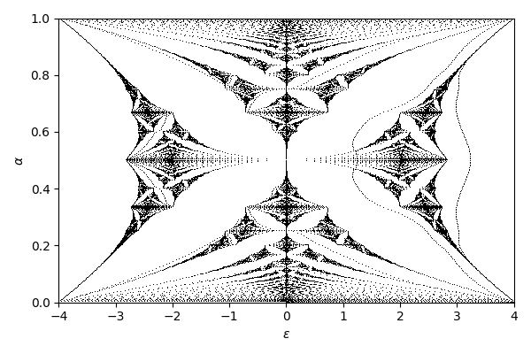

<head>
<title>Hofstadter's Butterfly</title>
<script id="MathJax-script" async src="https://cdn.jsdelivr.net/npm/mathjax@3/es5/tex-mml-chtml.js"></script>
<link href="https://fonts.googleapis.com/css2?family=Open+Sans&family=Roboto+Mono&display=swap" rel="stylesheet">
<style>
body {
    background-color: #f0f0f0;
    margin: 40px auto;
    max-width: 800px;
    line-height: 1.6;
    font-size: 18px;
    color: #222;
    padding: 0 10px;
    font-family: 'Open Sans', sans-serif;
}
h1, h2, h3 {
    line-height:1.2;
}
pre code {
    background-color: #ddd;
    display: block;
    padding: 10px 20px;
    font-size: 16px;
    font-family: 'Roboto Mono', monospace;
}
</style>
<body>

# Hofstadter's Butterfly

## About

Crystals have a recurring lattice structure with a given periodicity. Usually the atoms are a few angstroms apart, thats a few times \\(10^{-10}\\) meters. In conductors, electrons can move about in this lattice. If you turn on a magnetic field, then these electrons will undergo cyclotron motion. For small fields the radius of the cyclotron motion will be much larger than the lattice spacing, but as you go to higher and higher fields, you might get closer to it. In 1976, Douglas Hofstadter published a nice paper[[1]](#fn1) describing an interesting relationship having to do with the ratio of the magnetic flux to the size of the lattice of 2D crystals.

The symbol \\(\alpha\\) represents the ratio of the magnetic field \\(H\\) to the size of the lattice \\(a\\), with appropriate constant factors to make it dimensionless. In experiments, we usually cannot change the size of the lattice, but we can change the strength of the magnetic field.

$$\alpha = a^2 H / 2\pi (\hbar c/e)$$

After a fair amount of work, Hofstadter derives an eigenvalue equation relating the energy of a state \\(\epsilon\\) to \\(\alpha\\). There's a phase factor \\(\nu\\) that is important in some situations.

$$g(m+1)+g(m-1)+2\cos(2\pi m\alpha-\nu)g(m)=\epsilon g(m)$$

The set of \\(\epsilon\\) and \\(\alpha\\) that solve this equation make up the butterfly. The strange result is that the solutions seem to depend on the rationality of \\(\alpha\\). Specifically, if \\(\alpha = p/q\\) for integers \\(p\\) and \\(q\\), then there will be \\(q\\) intervals of energy that solve the problem. This is unusual, because we can continuously tune field, and a tiny change in field may lead to an enormous change of \\(q\\).

For those who know what a Spirograph is, the rationality criterion is analogous to the fact that the Spirograph will eventually trace back over itself only if the ratio of the size of the wheels is rational.

Anyway, enough talk. Lets compute it. I'm going to use Python, because it's rad.

## Imports

```
import time

import numpy as np
import scipy
import scipy.signal
import scipy.linalg
import matplotlib.pyplot as plt
```

## Original way

Hofstadter does additional work and shows that a necessary condition for the solution to be physically meaningful is for the following inequality to hold, where \\(\alpha = p/q\\) and \\(\nu = \pi/2q\\).

$$\left\lvert \mathrm{Tr} \prod_{m=0}^q \begin{pmatrix} \epsilon - 2\cos(2\pi m \alpha - \nu) & -1 \\\\ 1 & 0\end{pmatrix} \right\rvert \leq 4$$

Define the matrix like so. I use unicode for identifiers so that it's more clear how the code maps to the equations.

```
def A(ε, m, α, ν):
    return np.array([[ε - 2*np.cos(2*np.pi*m*α - ν), -1], [1, 0]])
```

We need a rational list of magnetic fields and energies to compute this trace at. If you want a higher quality fan, add more prime numbers to the list, or increase the resolution of energies.

```
αs = []
for q in [2, 3, 5, 7, 11, 13, 17, 19]:
    for p in range(1, q // 2 + 1):
        αs.append((p / q, p, q))
αs = sorted(αs, key=lambda x: x[0])
εs = np.linspace(-4, 4, 1001)
```

Now iterate over all fields and energies, computing the trace of the product for each. This takes about 3 seconds on my laptop.

```
trs = np.empty((len(αs), len(εs)))
start = time.time()
for i, (_, p, q) in enumerate(αs):
    for j, ε in enumerate(εs):
        m = np.eye(2)
        for k in range(q):
            m = A(ε, k, p/q, np.pi/2/q) @ m
        trs[i, j] = np.abs(np.trace(m))
print(f'Completed in {time.time() - start:.2f} s')
```

Now plot every point that has trace less than 4. If you rearrange this code such that there is a plot call for each point, the code will be much simpler but also extremely slow. That's why I filter the output before calling plot once.

```
xs = []
ys = []
for (α, _, _), tr in zip(αs, trs):
    for ε, t in zip(εs, tr):
        if t < 4:
            xs.extend([ε, ε])
            ys.extend([α, 1 - α])
plt.figure(figsize=(6, 4))
plt.plot(xs, ys, 'k,')
plt.xlim(-4, 4)
plt.ylim(0, 1)
plt.xlabel('$\\epsilon$')
plt.ylabel('$\\alpha$')
plt.tight_layout()
plt.show()
```


Not bad! There are a few problems though. Firstly, to get a better picture we'll need to go to higher \\(q\\) and finer \\(\epsilon\\). The runtime will depend linearly on the resolution in \\(\epsilon\\) and quadratically in \\(q\\). The actual traces can be very sharp in energy, which means that if our spacing isn't fine enough we will miss solutions, which is especially noticable at the corners and edges of the butterfly. By going up to \\(q=29\\) we get a nicer image, but it's still not exactly perfect.


## Another way

We can go back to the eigenvalue equation and solve it more directly.


```
def Hamiltonian(size, α, ν):
    H = np.zeros((size, size))
    for i in range(size):
        H[i, i] = 2 * np.cos(2 * np.pi * i * α - ν)
        H[(i + 1) % size, i] = 1
        H[(i - 1) % size, i] = 1
    return H
```

Now just calculate the eigenvalues for various different fields. No need to worry about rationality. This takes under a second on my laptop.

```
size = 200
αs = np.linspace(0.0, 0.5, 101)
νs = np.linspace(0, 2 * np.pi, 1, endpoint=False)

eigs = np.zeros((len(αs), len(νs), size))
start = time.time()
for i, α in enumerate(αs):
    for j, ν in enumerate(νs):
        eigs[i, j, :] = scipy.linalg.eigvalsh(Hamiltonian(size, α, ν))
eigs = eigs.reshape((len(αs), len(νs)*(size)))
print(f'Completed in {time.time() - start:.2f} s')
```

And plot them.

```
plt.figure(figsize=(6, 4))
plt.plot(eigs, αs, ',', color='k')
plt.plot(eigs, 1 - αs, ',', color='k')
plt.xlim(-4, 4)
plt.ylim(0, 1)
plt.xlabel('$\\epsilon$')
plt.ylabel('$\\alpha$')
plt.show()
```


Looks good!

There's an added bonus, too. Because we are computing energy states and not just ranges, we can easily find the density of the biggest gaps in the system. In electrical transport measurements in graphene, we usually directly control density, not energy, so this is important. Shortly after Hofstadter's work, G. H. Wannier predicted[[2]](#fn2) that the density of the gaps would fall on straight lines described by diophantine equations \\(\alpha = (n-s)/t\\) for integer \\(s\\) and \\(t\\).

For a given field \\(\alpha\\) we have a list of eigenenergies. Sort them, then take the diff from one to the next. Gaps will show up as large diffs here. The density at the gap is the total number of states with lower energy. Because the list is sorted, that's just its index in the list.
```
topn = np.argsort(np.diff(np.sort(eigs)))[:,-10:] / size / len(νs)
```

```
plt.figure(figsize=(6, 4))
plt.plot(topn, αs, ',', color='k')
plt.plot(topn, 1 - αs, ',', color='k')
plt.ylim(0, 1)
plt.xlim(0, 1)
plt.ylabel('$\\alpha$')
plt.xlabel('$n$')
plt.show()
```


This recovers the expected diophantine behavior. Nice! This behavior has been observed in graphene-hBN superlattices by multiple groups[[3]](#fn3)[[4]](#fn4). Those aren't exactly identical since they are on a different lattice, but the idea is the same.

There's a pretty big problem with this approach, however. The Hamiltonian we are computing is finite, but in physics we live in an infinite-dimensional Hilbert space. This means that if we increase the resolution in \\(\alpha\\) then we may run into finite size effects.

Here all I have done is double the resolution compared to the previous plots. The two plots have \\(\nu=0\\) and \\(\nu=2\\). Note that there are states in the gaps. This is bad!




I think it's cool that you can still see the butterfly in very small lattices. Here I've set size to 10 and I'm sweeping \\(\nu\\) between \\(0\\) and \\(2\pi\\).


Cool.

# References

<a name="fn1">[1]: Hofstadter, Douglas R. (1976). "Energy levels and wavefunctions of Bloch electrons in rational and irrational magnetic fields". *Physical Review B.* **14** (6): 2239–2249.</a>

<a name="fn2">[2]: Wannier, G. H. (1978). "A Result Not Dependent on Rationality for Bloch Electrons in a Magnetic Field". *Physica Status Solidi (b)*, **88** (2): 757-765.</a>

<a name="fn3">[3]: Hunt, B.; Sanchez-Yamagishi, J. D.; Young, A. F.; Yankowitz, M.; LeRoy, B. J.; Watanabe, K.; Taniguchi, T.; Moon, P.; Koshino, M.; Jarillo-Herrero, P.; Ashoori, R. C. (2013). "Massive Dirac fermions and Hofstadter butterfly in a van der Waals heterostructure". *Science.* **340** (6139): 1427–1430.</a>

<a name="fn4">[4]: Dean, C. R.; Wang, L.; Maher, P.; Forsythe, C.; Ghahari, F.; Gao, Y.; Katoch, J.; Ishigami, M.; Moon, P.; Koshino, M.; Taniguchi, T.; Watanabe, K.; Shepard, K. L.; Hone, J.; Kim, P. (30 May 2013). "Hofstadter's butterfly and the fractal quantum Hall effect in moiré superlattices". *Nature.* **497** (7451): 598–602.</a>

# TODO

1. Plot a Spirograph.
1. Lyapunov exponent computation.
1. Talk about perf in more detail.
1. Two interacting butterflies.
1. Honeycomb lattice.
1. Hall conductivity.
